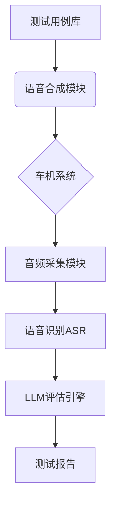

# 车机语音操作LLM自动化测试系统

## 项目概述
本系统是一个自动化测试工具，通过语音指令和LLM反馈验证车机语音交互功能的正确性，替代人工测试流程。系统将文本指令转换为语音输入车机，捕获车机响应后通过大模型评估交互是否成功。

## 核心功能
- 测试用例管理：支持CSV/JSON/YAML格式的批量导入与管理
- 语音模拟输入：通过TTS引擎将文本指令转换为语音信号
- 车机响应捕获：实时录制车机语音响应（支持串口/USB/蓝牙）
- 语音转文本：使用ASR引擎将车机响应音频转换为文本
- LLM评估引擎：通过大模型判断指令-响应的匹配性
- 异常处理：处理无响应/低质量音频/网络异常等情况
- 多环境模拟：支持噪声环境/不同方言的测试场景

## 系统架构


## 安装与使用

### 环境要求
- Python 3.10+
- FFmpeg（音频处理）
- ADB工具（Android设备连接）
- CUDA 11.8（GPU加速ASR）

### 安装步骤
1. 克隆仓库
2. 安装依赖：
   ```bash
   pip install -r requirements.txt
   ```

### 运行测试
```bash
python main.py \
    --test-case test_cases/导航.yaml \
    --environment noise=20db \
    --asr-engine whisper \
    --llm gpt-4
```

## 测试流程
1. 初始化配置
   ```bash
   python main.py --config device.yaml --model gpt-4
   ```
2. 执行测试用例：
   - 生成指令语音
   - 播放给车机系统
   - 录制车机响应
   - 语音转文本
   - LLM评估交互
   - 生成测试报告

## 技术选型
| 组件     | 候选方案                      |
| -------- | ----------------------------- |
| TTS引擎  | Google TTS / Azure Neural TTS |
| ASR引擎  | Whisper-large / 科大讯飞引擎  |
| LLM      | Deepseek-v3-0324 / Deepseek-r1 / Qwen-max        |
| 音频采集 | PyAudio / SoundDevice         |

## 性能指标
- 单条测试周期 ≤5s（含语音交互+LLM处理）
- 误判率 <2%（基于标准测试集）
- 支持Android/Linux车机系统

## 质量保障
- 标准测试集包含：
  - 基础功能指令（导航/音乐/空调）200条
  - 边界测试指令（超长语句/特殊字符）50条 
  - 多方言测试指令（粤语/四川话）100条
  - 噪声环境测试（信噪比<15dB）50条

## 贡献指南
欢迎提交Pull Request，请确保：
1. 通过所有单元测试
2. 更新相关文档
3. 遵循代码风格规范
