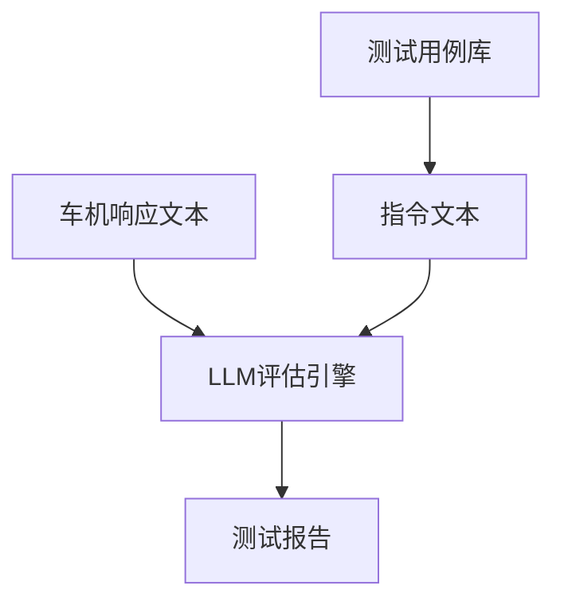
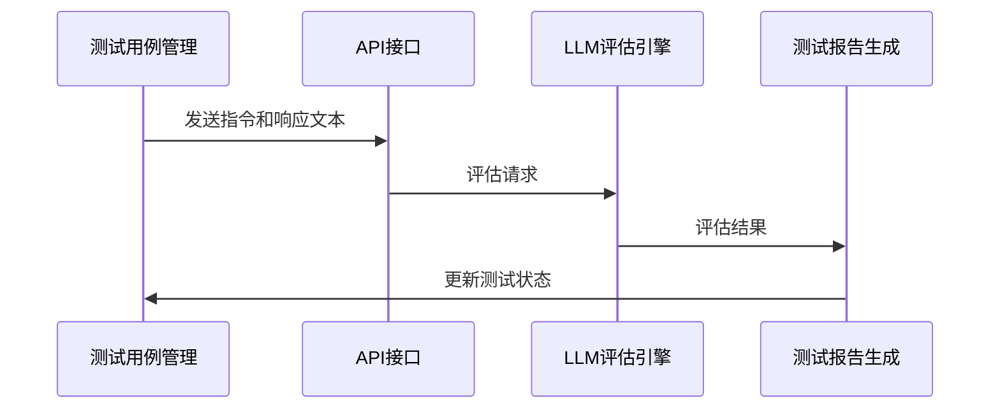
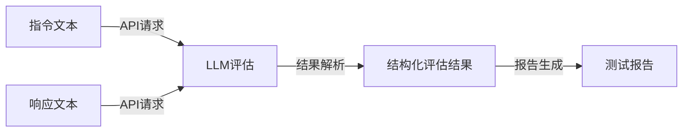

# 车机语音操作LLM自动化测试系统

## 项目概述
本系统是一个自动化测试工具，通过LLM评估车机语音交互功能的正确性，替代人工测试流程。系统接收文本指令和车机响应文本，通过大模型评估交互是否成功。

## 核心功能
- 测试用例管理：支持CSV/JSON/YAML格式的批量导入与管理
- LLM评估引擎：通过大模型判断指令-响应的匹配性
- 异常处理：处理网络异常等情况
- API接口：提供RESTful API接口供外部系统调用

## 系统架构


## 安装与使用

### 环境要求
- Python 3.10+
- 支持的LLM API密钥（OpenRouter、阿里云百炼等）

### 安装步骤
1. 克隆仓库
2. 安装依赖：
   ```bash
   pip install -r requirements.txt
   ```
3. 配置环境变量（.env文件）：
   ```
   OPENROUTER_API_KEY=your_api_key
   DASHSCOPE_API_KEY=your_api_key
   ```

### 运行服务
```bash
uvicorn src.main:app --reload
```

## 后端测试流程
1. 准备测试用例（指令和响应文本对）
2. 通过API发送评估请求：
   ```bash
   curl -X POST "http://localhost:8000/api/analyze" \
     -H "Content-Type: application/json" \
     -d '{"sample": "打开空调", "machineResponse": "空调已打开"}'
   ```
3. 获取LLM评估结果
4. 生成测试报告

## 技术选型与实现细节

### 核心组件
| 组件     | 选用方案                      | 实现细节                                                     |
| -------- | ----------------------------- | ------------------------------------------------------------ |
| LLM评估  | Deepseek-v3 / Gemini-2.0-flash| 通过LangChain框架集成多种大模型，支持OpenRouter和阿里云百炼平台 |

### 技术栈详情
- **后端框架**: FastAPI (提供RESTful API和WebSocket支持)
- **LLM集成**: LangChain (提供统一的大模型调用接口和输出解析)
- **数据验证**: Pydantic (实现请求和响应模型的结构化验证)
- **测试框架**: Pytest (单元测试和集成测试)
- **环境配置**: python-dotenv (管理API密钥和环境变量)
- **并发处理**: asyncio (异步处理多个测试用例)

## 性能指标与优化

### 基准性能
- **测试周期**: 单条测试评估时间 ≤3s（LLM处理）
- **准确率**: 误判率 <2%（基于标准测试集）
- **并发能力**: 支持多测试用例并行处理

### 性能优化策略
- **LLM响应缓存**: 对相似指令-响应对的评估结果进行缓存
- **批量处理**: 支持测试用例批处理以提高吞吐量
- **资源监控**: 实时监控CPU/内存使用情况，动态调整并发数

## 质量保障与测试策略

### 标准测试集
- **基础功能测试**: 导航/音乐/空调等常用功能指令 (200条)
  ```yaml
  - instruction: "导航到上海迪士尼"
    expected_response: "已为您规划前往上海迪士尼的路线"
  ```
- **边界测试**: 超长语句/特殊字符/模糊指令 (50条)
  ```yaml
  - instruction: "我想去一个，嗯，就是那个，上海的那个迪士尼乐园"
    expected_response: "已为您规划前往上海迪士尼的路线"
  ```

### 评估维度
- **语义正确性**: 车机是否准确理解指令意图 (权重: 0.4)
- **状态变更确认**: 是否明确告知用户操作结果 (权重: 0.4)
- **无歧义表述**: 响应是否清晰无歧义 (权重: 0.2)

### 持续集成
- 自动化测试流水线
- 性能回归测试
- 代码质量检查

## 系统架构详解

### 模块交互流程


### 数据流转换


### 扩展接口
系统提供以下扩展点:
- **LLM评估接口**: 支持自定义大模型评估逻辑
- **API接口**: 支持自定义评估请求格式

## 项目结构
```
autotest-system/
├── configs/                # 配置文件目录
├── data/                   # 测试数据目录
│   └── testcases/          # 测试用例存储
├── docs/                   # 文档目录
│   ├── 需求文档.md         # 项目需求文档
│   ├── api_reference.md    # API参考文档  
│   └── instruction.md      # 开发指导文档
├── src/                    # 源代码目录
│   ├── main.py             # 主程序入口
│   ├── core/               # 核心逻辑
│   │   └── evaluation.py   # LLM评估引擎实现
│   ├── interface/          # 接口定义
│   └── utils/              # 工具类
├── tests/                  # 测试代码
│   ├── integration/        # 集成测试
│   └── unit/               # 单元测试
│       └── test_evaluation.py  # 评估模块测试
├── .env                    # 环境变量配置
├── .gitignore              # Git忽略规则
├── README.md               # 项目说明文档
├── requirements.txt        # Python依赖
├── result.json             # 测试结果示例
└── setup.py                # 项目安装配置
```

## 贡献指南
欢迎提交Pull Request，请确保：
1. 通过所有单元测试 (`pytest tests/`)
2. 更新相关文档
3. 遵循代码风格规范 (使用Black格式化)
4. 添加适当的类型注解
