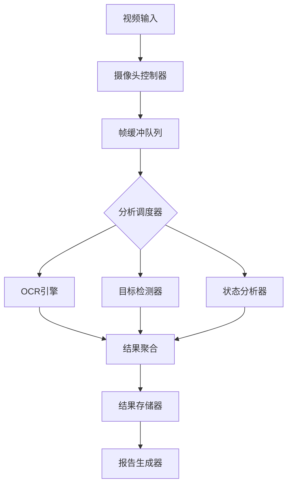
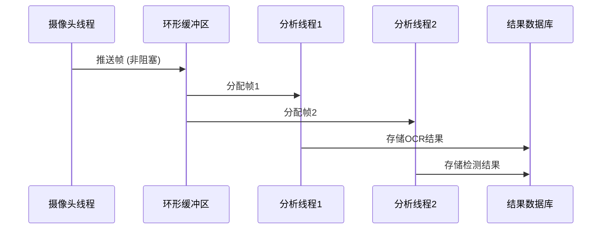

# 车机视觉验证系统开发方案

## 1. 系统架构

### 1.1 模块架构图


### 1.2 技术栈
| 组件           | 技术选型                  |
|----------------|--------------------------|
| 视频输入        | OpenCV + AVFoundation    |
| 多线程框架      | Python ThreadPoolExecutor|
| OCR引擎         | EasyOCR + 后处理规则引擎  |
| 目标检测        | YOLOv8s (ONNX格式)       |
| 配置管理        | YAML + Pydantic          |
| 日志系统        | loguru + 文件轮转        |

## 2. 核心实现方案

### 2.1 摄像头控制模块
```python
class CameraController:
    def __init__(self, config: CameraConfig):
        self.cap = cv2.VideoCapture(config.device_index)
        self._setup_camera(config)
        
    def _setup_camera(self, config):
        self.cap.set(cv2.CAP_PROP_FRAME_WIDTH, config.resolution[0])
        self.cap.set(cv2.CAP_PROP_FRAME_HEIGHT, config.resolution[1])
        self.cap.set(cv2.CAP_PROP_FPS, config.fps)
        self.cap.set(cv2.CAP_PROP_BUFFERSIZE, 2)  # 减少缓冲延迟
        
    def stream_generator(self):
        while self.running:
            ret, frame = self.cap.read()
            if not ret:
                self._handle_error()
            yield preprocess_frame(frame)
```

### 2.2 多线程处理架构


## 3. 开发阶段规划

### 3.1 阶段里程碑
```gantt
    title 开发阶段甘特图
    dateFormat  YYYY-MM-DD
    section 基础框架
    摄像头控制模块       :done, 2025-05-06, 3d
    多线程架构实现       :active, 2025-05-09, 5d
    section 核心功能
    OCR集成           : 2025-05-14, 4d
    YOLO模型部署       : 2025-05-18, 3d
    section 系统集成
    独立数据库实现      : 2025-05-21, 4d
    压力测试          : 2025-05-25, 3d
```

### 3.2 阶段实施指南

#### 阶段一：视频采集基础
1. 实现摄像头自动发现与选择逻辑
2. 开发带丢帧策略的环形缓冲区
3. 添加摄像头异常监控与恢复机制

#### 阶段二：视觉分析核心
1. 集成EasyOCR并优化预处理流程
2. 部署量化版YOLOv8s模型（ONNX格式）
3. 实现基于颜色直方图的状态分析

#### 阶段三：系统集成
1. 设计SQLite结果存储方案
2. 开发PDF/CSV报告生成器
3. 实现资源监控看板

## 4. 配置管理系统

### 4.1 配置文件示例（config/vision.yaml）
```yaml
camera:
  device_index: 0     # 摄像头设备索引
  resolution: [1280, 720]
  fps: 30
  auto_reconnect: true
  
analysis:
  ocr:
    languages: ['ch_sim', 'en']
    gpu: true
  yolo:
    model_path: "models/yolov8s.onnx"
    confidence: 0.6
```

### 4.2 配置类设计
```python
class VisionConfig(BaseModel):
    camera: CameraConfig
    analysis: AnalysisConfig
    logging: LoggingConfig
    
    @classmethod
    def load(cls, path: str):
        with open(path) as f:
            raw = yaml.safe_load(f)
            return cls(**raw)
```

## 5. 测试验证方案

### 5.1 测试用例设计
| 测试类型       | 方法                  | 预期指标            |
|---------------|-----------------------|--------------------|
| 帧处理延迟     | 时间戳差值统计        | 平均 < 50ms        |
| OCR准确率      | 标准测试图集验证      | 中文准确率 > 92%   |
| 异常恢复       | 模拟摄像头断开        | 30秒内自动恢复     |
| 内存泄漏       | 24小时压力测试        | 内存波动 < ±5%     |

### 5.2 性能测试脚本
```bash
# 启动压力测试
python -m vision.test.stress_test \
  --duration 3600 \
  --report interval=60
```

---
**下一步行动建议：**
1. 确认文档内容准确性
2. 使用`write_to_file`工具保存到docs目录
3. 切换至代码模式开始实施