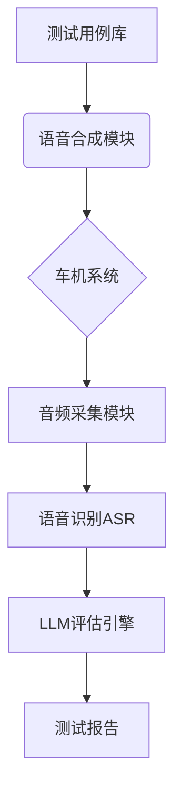

# 需求文档：车机语音操作LLM自动化测试系统

### 1. 项目背景

开发一个自动化测试工具，通过语音指令和LLM反馈验证车机语音交互功能的正确性，替代人工测试流程。

---

### 2. 核心需求
#### 功能需求
| 模块         | 功能描述                                   | 优先级 |
| ------------ | ------------------------------------------ | ------ |
| 测试用例管理 | 支持批量导入/管理文本指令（CSV/JSON/YAML） | P0     |
| 语音模拟输入 | 将文本指令转换为语音信号输入车机           | P0     |
| 车机响应捕获 | 实时录制车机语音响应（支持串口/USB/蓝牙）  | P0     |
| 语音转文本   | 将车机响应音频转换为文本（ASR引擎）        | P0     |
| LLM评估引擎  | 通过大模型判断指令-响应的匹配性            | P0     |
| 异常处理     | 处理无响应/低质量音频/网络异常             | P1     |
| 多环境模拟   | 支持噪声环境/不同方言的测试场景            | P2     |

#### 非功能需求

```markdown
- 性能：单条测试周期 ≤5s（含语音交互+LLM处理）
- 准确率：误判率 <2%（需定义标准测试集）
- 兼容性：支持Android/Linux车机系统
- 扩展性：可接入不同ASR服务（Google/Whisper等）
```

---

# instruction.md 开发指导文档

## 系统架构


## 核心模块实现

### 1. 语音交互模块
```python
# 伪代码示例：语音输入输出处理
class VoiceHandler:
    def text_to_speech(self, text):
        """使用TTS引擎生成语音文件"""
        return audio_file.mp3
        
    def play_audio(self, file):
        """通过物理接口发送音频信号"""
        os.system(f"adb shell am start -a android.intent.action.VIEW -t audio/mp3 -d {file}")

    def record_response(self, timeout=10):
        """录制车机响应音频"""
        return capture_audio(timeout)
```

### 2. LLM评估接口
```python
# GPT-4评估示例
def evaluate_with_llm(instruction, response):
    prompt = f"""作为车机系统测试专家，请判断对指令"{instruction}"的响应"{response}"是否有效：
    有效标准：
    1. 语义正确性（核心功能匹配）
    2. 状态变更确认（明确操作结果）
    3. 无歧义表述
    
    请用JSON格式返回：
    {"valid": bool, "reason": string}
    """
    
    return call_gpt4_api(prompt)
```

## 测试流程设计
1. **初始化配置**
   ```bash
   $ python main.py --config device.yaml --model gpt-4
   ```

2. **执行测试用例**
   ```python
   for case in test_cases:
       audio = tts.generate(case["instruction"])
       play_audio(audio)
       response_audio = record_audio()
       response_text = asr.transcribe(response_audio)
       result = llm.evaluate(case["instruction"], response_text)
       generate_report(result)
   ```

## 关键技术选型
| 组件     | 候选方案                      |
| -------- | ----------------------------- |
| TTS引擎  | Google TTS / Azure Neural TTS |
| ASR引擎  | Whisper-large / 科大讯飞引擎  |
| LLM      | GPT-4 Turbo / Claude 3        |
| 音频采集 | PyAudio / SoundDevice         |

## 测试指标定义
```python
# 测试结果统计维度
METRICS = [
    "指令识别准确率",
    "响应延迟（语音输入到响应开始）",
    "端到端处理时间",
    "LLM置信度得分",
    "跨方言兼容性",
    "噪声环境鲁棒性"
]
```

